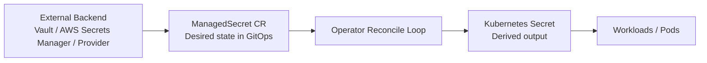
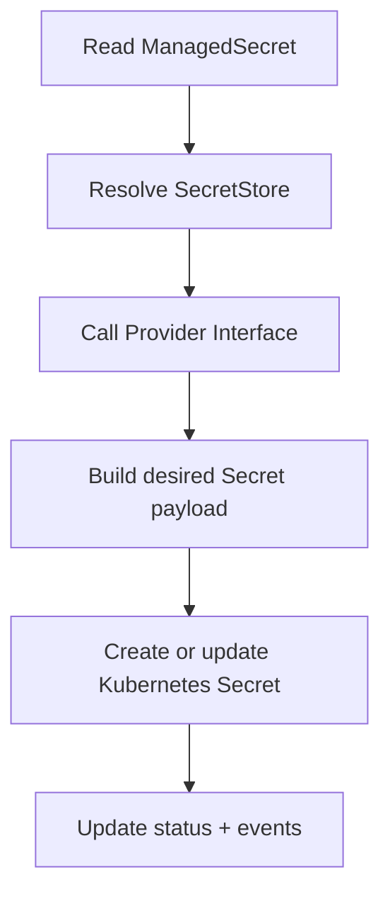

# secrets-operator

Kubernetes operator that syncs secrets from external backends into the cluster as native Kubernetes Secrets.

Status: Under active development — not production ready

## Overview
The operator is designed to be backend-agnostic. It watches `ManagedSecret` resources, reads secret data from an external provider such as Vault or AWS Secrets Manager via a referenced `SecretStore`, and materializes the result as a native Kubernetes `Secret` object.

### MVP resource model
The user-facing API is two CRDs, split by concern:

- **`SecretStore`** — where a backend lives and how to authenticate to it. Namespaced. Owned/RBAC-scoped to whoever manages backend credentials (e.g. platform/security team). One `SecretStore` can be referenced by many `ManagedSecret`s, so credential or endpoint changes happen in one place instead of N.
- **`ManagedSecret`** — which remote keys to fetch, which `SecretStore` to fetch them through, and how to materialize them as a Kubernetes `Secret`. Namespaced. Owned by app teams via GitOps.

The operator resolves `ManagedSecret.spec.storeRef` to a `SecretStore` in the same namespace, then uses `SecretStore.spec.providerType` to select the backend adapter and reconcile the derived Kubernetes `Secret`.

The provider layer is designed as an extensible adapter model. Each backend family such as Vault, AWS Secrets Manager, or a mock/demo provider can provide its own read logic and configuration shape. The controller remains generic and only relies on the selected provider type to route reconciliation to the correct provider implementation.

### Minimal `SecretStore` shape
- `metadata.name`
- `metadata.namespace`
- `spec.providerType` — provider type such as `vault`, `aws-secrets-manager`, or `mock`
- `spec.providerConfig` — backend-specific connection/auth configuration whose shape depends on `spec.providerType` (e.g. Vault endpoint + role, or AWS region + role ARN)

### Minimal `ManagedSecret` shape
- `metadata.name`
- `metadata.namespace`
- `spec.storeRef` — name of the `SecretStore` (same namespace) to fetch through
- `spec.targetSecretName` — the name of the Kubernetes Secret to create or update
- `spec.refreshInterval` — sync cadence
- `spec.remoteRefs` — one or more remote references to read from the provider
- `spec.deletionPolicy` — cleanup behavior when the remote value is missing or the sync fails

The operator does not require a single universal `remoteRefs` schema across all providers. Instead, each provider adapter can interpret `remoteRefs` according to its own backend contract. This is the extension point that makes it easy to add new provider types later.

Example for Vault:

```yaml
apiVersion: secrets.operator.io/v1alpha1
kind: SecretStore
metadata:
  name: vault-prod
  namespace: dev
spec:
  providerType: vault
  providerConfig:
    endpoint: https://vault.example.com
    role: app-role
---
apiVersion: secrets.operator.io/v1alpha1
kind: ManagedSecret
metadata:
  name: app-db-creds
  namespace: dev
spec:
  storeRef: vault-prod
  targetSecretName: app-db-creds
  refreshInterval: 5m
  remoteRefs:
    - path: secret/data/app
      key: db-password
  deletionPolicy: Retain
```

Example for AWS Secrets Manager:

```yaml
apiVersion: secrets.operator.io/v1alpha1
kind: SecretStore
metadata:
  name: aws-prod
  namespace: dev
spec:
  providerType: aws-secrets-manager
  providerConfig:
    region: us-east-1
    roleArn: arn:aws:iam::123456789012:role/secrets-operator
---
apiVersion: secrets.operator.io/v1alpha1
kind: ManagedSecret
metadata:
  name: app-db-creds
  namespace: dev
spec:
  storeRef: aws-prod
  targetSecretName: app-db-creds
  refreshInterval: 5m
  remoteRefs:
    - secretId: app/db/credentials
      versionStage: AWSCURRENT
  deletionPolicy: Retain
```

### Example use cases
- Multi-secret orchestration: split a single remote secret into multiple Kubernetes Secrets or key sets.
- Cross-namespace sync: push the same external secret into multiple namespaces.
- Combined flow: split one backend secret and replicate the derived outputs across environments.

## High-level architecture



## Reconcile flow



## Design docs
- [docs/high-level-design.md](docs/high-level-design.md)
- [docs/detailed-design.md](docs/detailed-design.md)

## Status
Under active development. Not production ready.