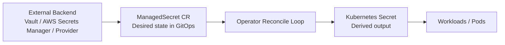
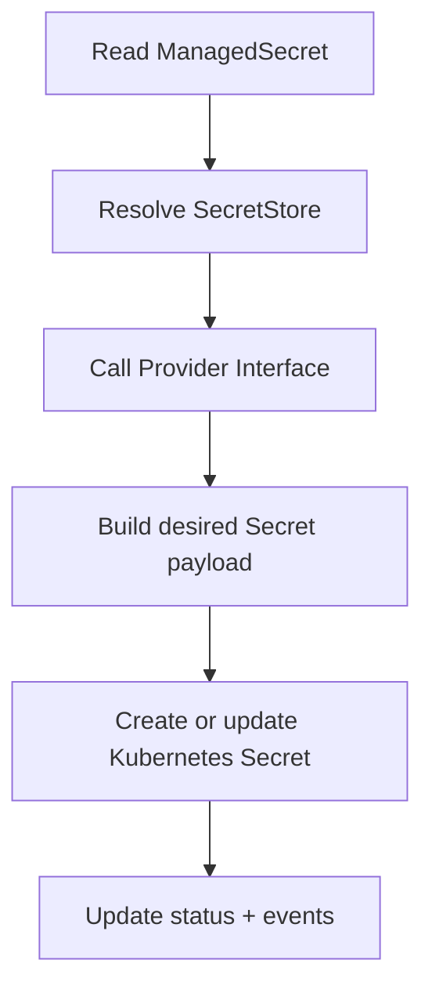

# secrets-operator

Kubernetes operator that syncs secrets from external backends into the cluster as native Kubernetes Secrets.

Status: Under active development — not production ready

## Overview
The operator is designed to be backend-agnostic. It watches `ManagedSecret` resources, reads secret data from an external provider such as Vault or AWS Secrets Manager, and materializes the result as a native Kubernetes `Secret` object.

### MVP resource model
For the first implementation, the user-facing CRD is a single `ManagedSecret` resource. The operator uses the `spec.providerType` value declared in that resource to select the correct backend adapter and reconcile the derived Kubernetes `Secret`.

This keeps the API simple for an interview/demo project while still allowing provider-specific behavior behind a stable interface.

### Minimal `ManagedSecret` shape
A minimal `ManagedSecret` should include the following fields:
- `metadata.name`
- `metadata.namespace`
- `spec.providerType` — provider type such as `vault`, `aws-secrets-manager`, or `mock`
- `spec.targetSecretName` — the name of the Kubernetes Secret to create or update
- `spec.refreshInterval` — sync cadence
- `spec.remoteRefs` — one or more remote references to read from the provider
- `spec.providerConfig` — backend-specific configuration block whose shape depends on `spec.providerType`
- `spec.deletionPolicy` — cleanup behavior when the remote value is missing or the sync fails

Example for Vault:

```yaml
apiVersion: secrets.operator.io/v1alpha1
kind: ManagedSecret
metadata:
  name: app-db-creds
  namespace: dev
spec:
  providerType: vault
  targetSecretName: app-db-creds
  refreshInterval: 5m
  remoteRefs:
    - path: secret/data/app
      key: db-password
  providerConfig:
    endpoint: https://vault.example.com
    role: app-role
  deletionPolicy: Retain
```

Example for AWS Secrets Manager:

```yaml
apiVersion: secrets.operator.io/v1alpha1
kind: ManagedSecret
metadata:
  name: app-db-creds
  namespace: dev
spec:
  providerType: aws-secrets-manager
  targetSecretName: app-db-creds
  refreshInterval: 5m
  remoteRefs:
    - secretId: app/db/credentials
      versionStage: AWSCURRENT
  providerConfig:
    region: us-east-1
    roleArn: arn:aws:iam::123456789012:role/secrets-operator
  deletionPolicy: Retain
```

### Example use cases
- Multi-secret orchestration: split a single remote secret into multiple Kubernetes Secrets or key sets.
- Cross-namespace sync: push the same external secret into multiple namespaces.
- Combined flow: split one backend secret and replicate the derived outputs across environments.

## High-level architecture



## Reconcile flow



## Design docs
- [docs/high-level-design.md](docs/high-level-design.md)
- [docs/detailed-design.md](docs/detailed-design.md)

## Status
Under active development. Not production ready.