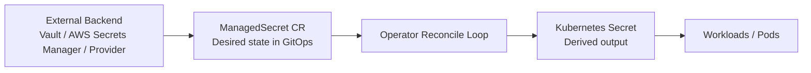
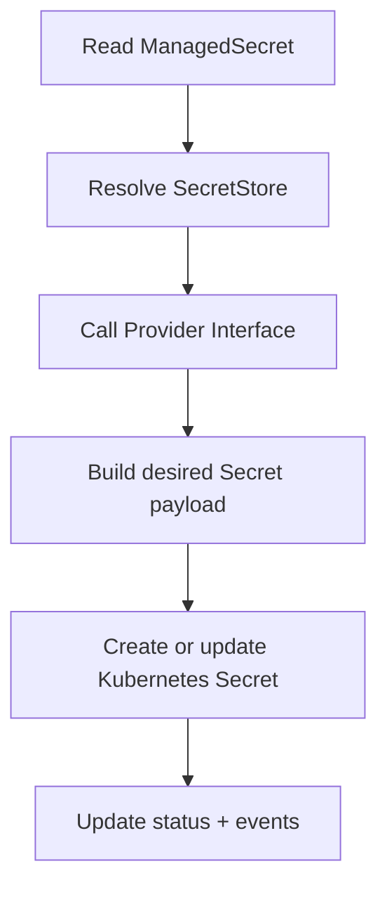

# secrets-operator

Kubernetes operator that syncs secrets from external backends into the cluster as native Kubernetes Secrets.

Status: Under active development — not production ready

## Overview
The operator is designed to be backend-agnostic. It watches `ManagedSecret` resources, reads secret data from an external provider such as Vault or AWS Secrets Manager, and materializes the result as a native Kubernetes `Secret` object.

### Why two CRDs?
- `SecretStore` defines how to connect to the backend and authenticate.
- `ManagedSecret` defines what should be synced into the cluster and how it should be managed.

This separates connection/auth concerns from desired secret output.

### Example use cases
- Multi-secret orchestration: split a single remote secret into multiple Kubernetes Secrets or key sets.
- Cross-namespace sync: push the same external secret into multiple namespaces.
- Combined flow: split one backend secret and replicate the derived outputs across environments.

## High-level architecture

## Reconcile flow

## Design docs
- [docs/high-level-design.md](docs/high-level-design.md)
- [docs/detailed-design.md](docs/detailed-design.md)

## Status
Under active development. Not production ready.